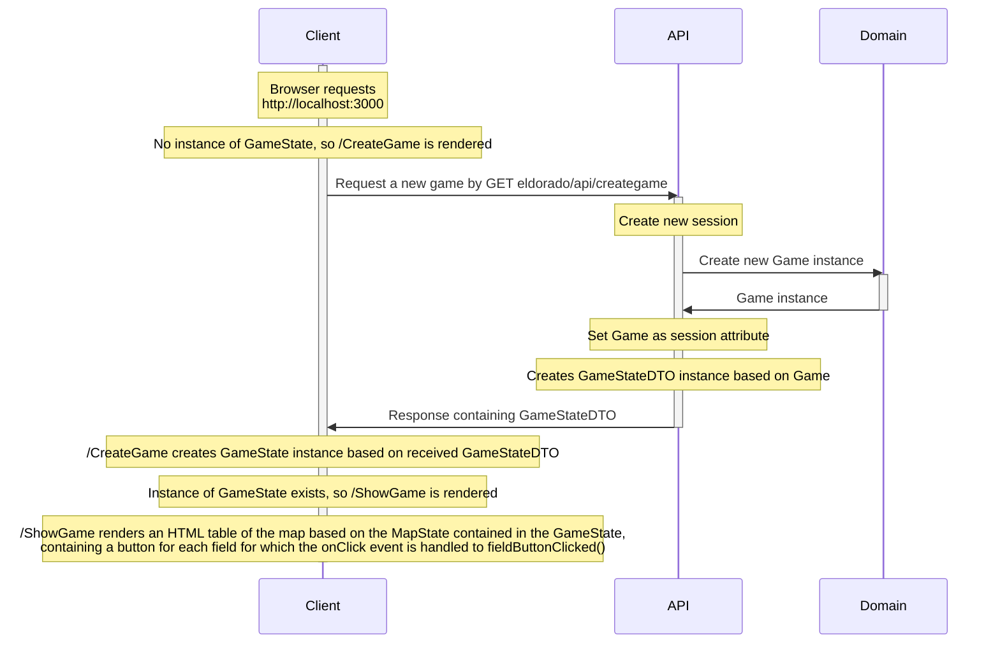
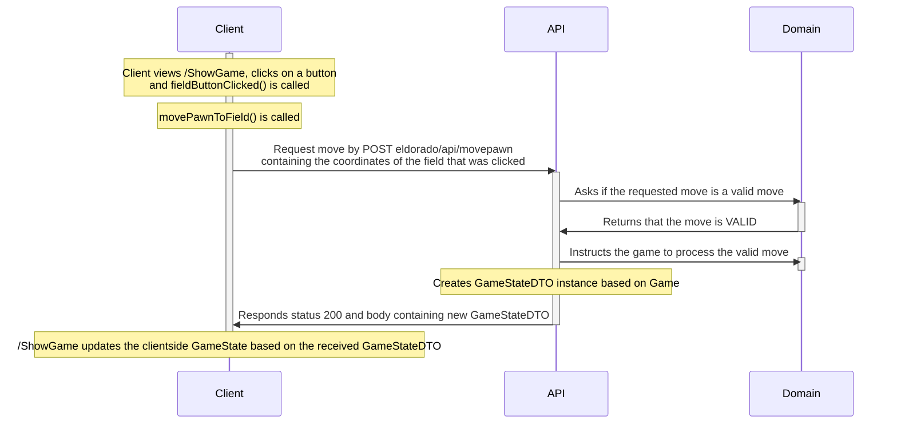
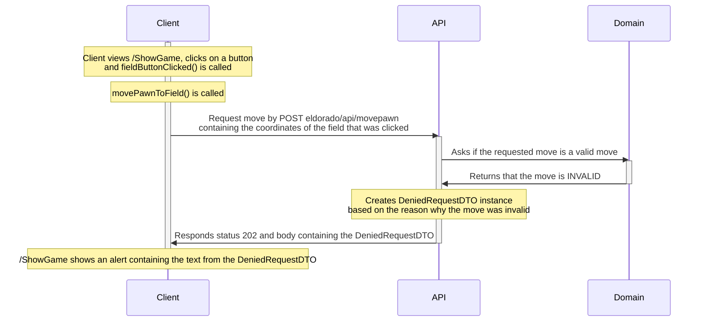
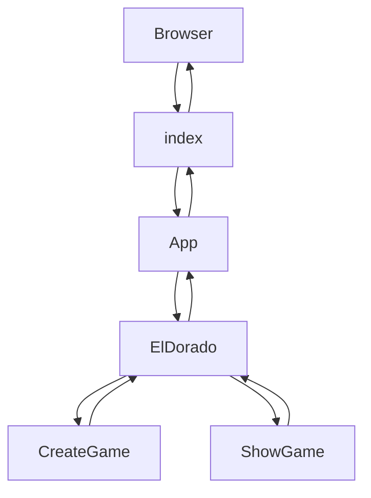
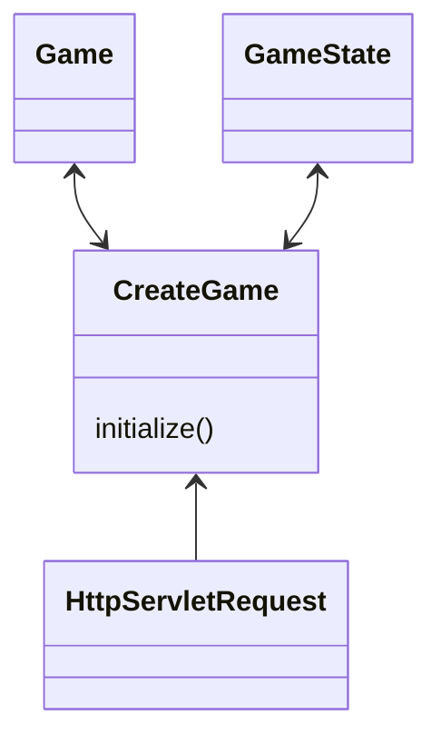
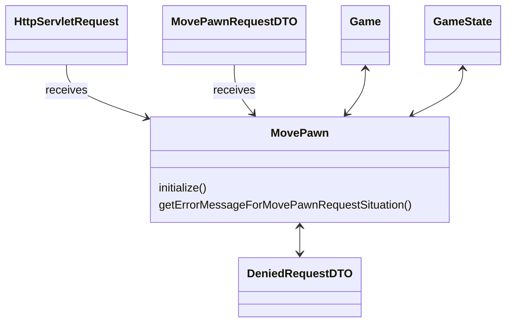
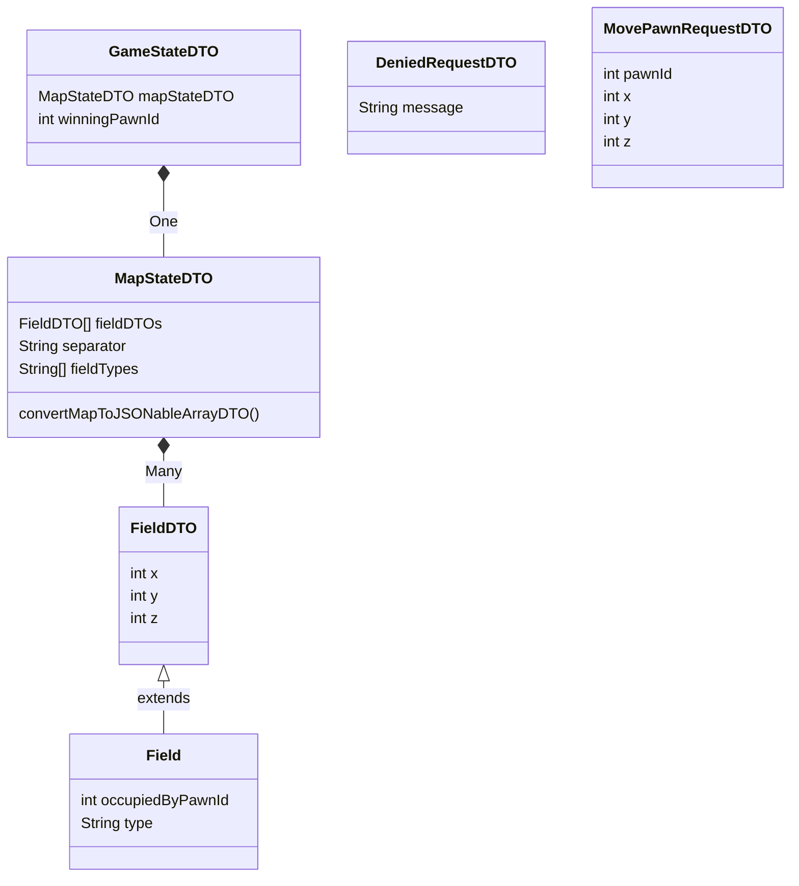
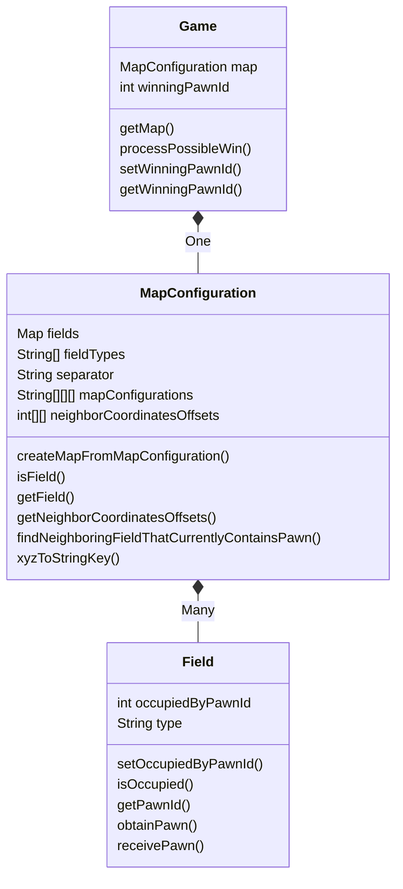

# Software architecture

## Main code flow
##### Client connects and gets to see the game map - sequence diagram

##### Client moves the pawn by performing a VALID move - sequence diagram

##### Client moves the pawn by performing an INVALID move - sequence diagram

##### Client pages flow

## Client class diagram
```mermaid
classDiagram
	GameStateDTO *-- MapStateDTO : One
	GameStateDTO : number winningPawnId
	GameStateDTO : MapStateDTO mapStateDTO
	MapStateDTO *-- FieldDTO : Many
	MapStateDTO : FieldDTO[] fieldDTOs
	MapStateDTO : string separator
	MapStateDTO : [] fieldTypes
	FieldDTO : number x
	FieldDTO : number y
	FieldDTO : number z
	FieldDTO : number occupiedByPawnId
	FieldDTO : string type
	GameState *-- MapState : One
	GameState : MapState mapState
	GameState : number winningPawnId
	GameState : int winner
	MapState *-- Field : Many
	MapState : {} fields
	MapState : string separator
	MapState : [] fieldTypes
	MapState : createFieldsArray()
	Field *-- Coordinates : One
	Field : number occupiedByPawnId
	Field : Coordinates coordinates
	Field : string type
	Coordinates : number x
	Coordinates : number y
	Coordinates : number z
	Coordinates : string rowColumnStringKey
	Coordinates : string xyzStringKey
	Coordinates : number rowId
	Coordinates : number columnId
	class MapBoundaries: created and temporarily used during construction
	MapBoundaries : update()
	MapBoundaries : number firstRowId
	MapBoundaries : number lastRowId
	MapBoundaries : number firstColumnId
	MapBoundaries : number lastColumnId
	class MovePawnRequestDTO : Called as a result of movePawnToField() and used in POST eldorado/api/movepawn
	MovePawnRequestDTO : number pawnId
	MovePawnRequestDTO : number x
	MovePawnRequestDTO : number y
	MovePawnRequestDTO : number z
	class DeniedRequestDTO : Received in eldorado/api/movepawn response if the move was not valid
	DeniedRequestDTO : string message
```
## API class diagram
##### eldorado.api


##### eldorado.api.dto

## Domain class diagrams
##### eldorado.domain
