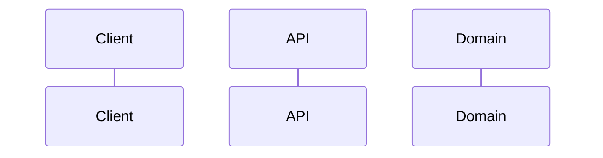
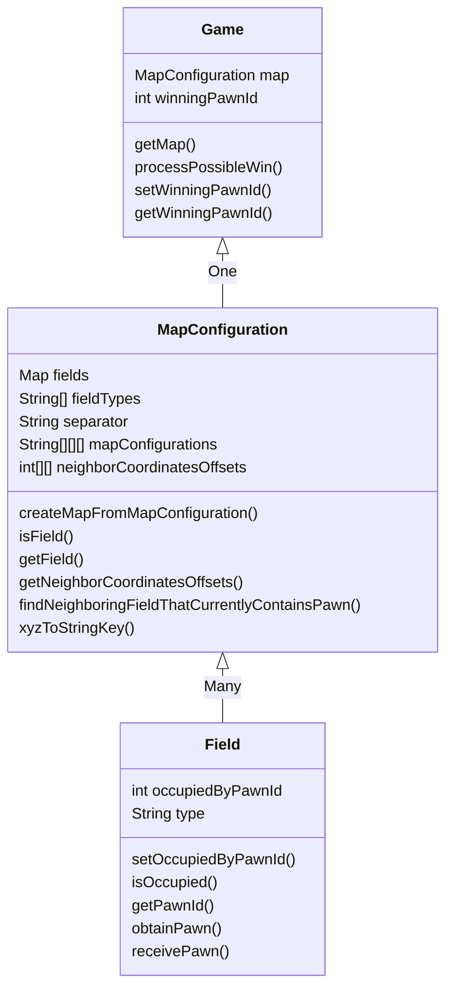
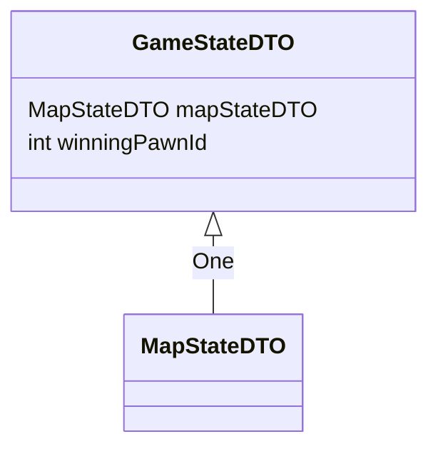

# Software architecture

## Main code flow

## Class diagrams per package

##### eldorado.domain
* import java.util.Map
* import java.util.HashMap

##### eldorado.domain.dto
* import eldorado.domain.*
