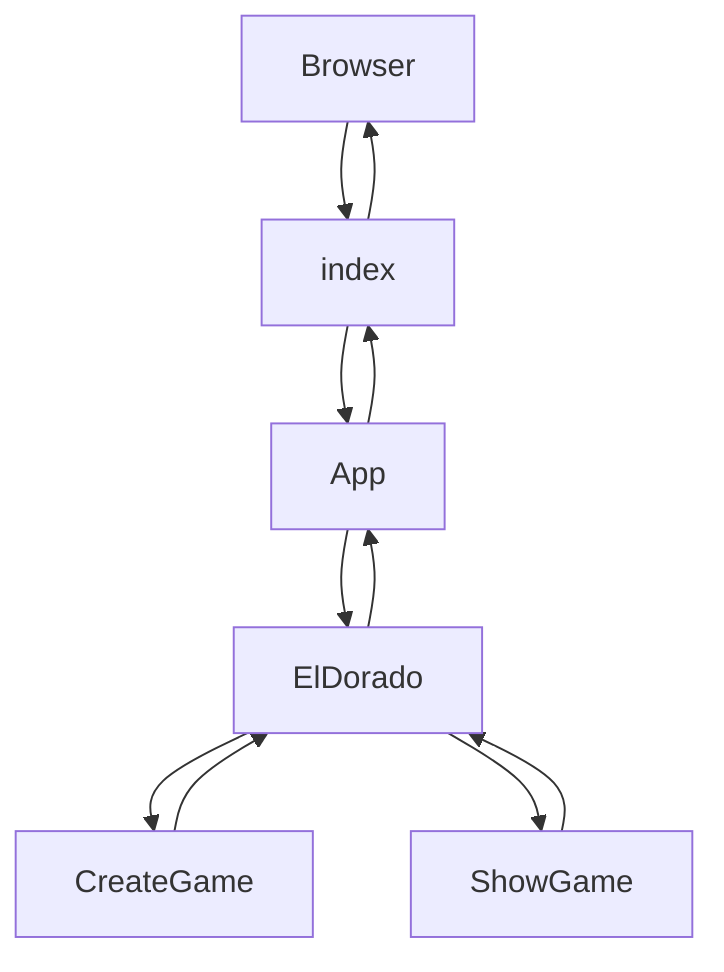
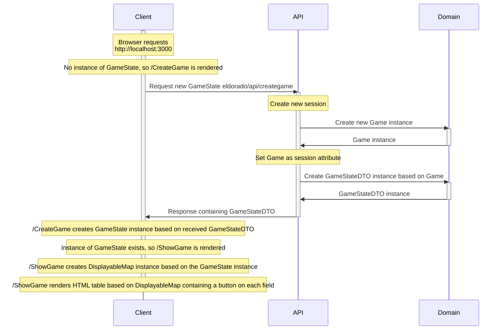
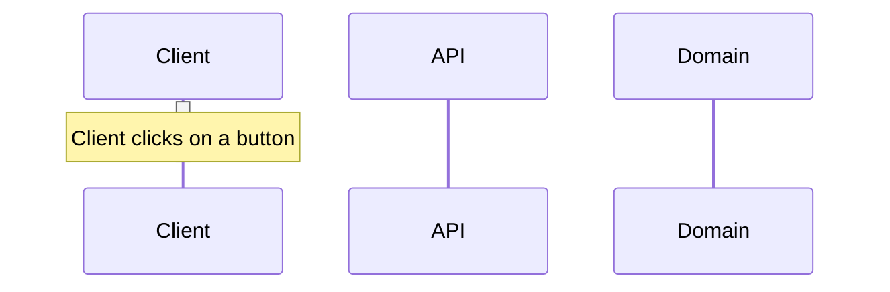
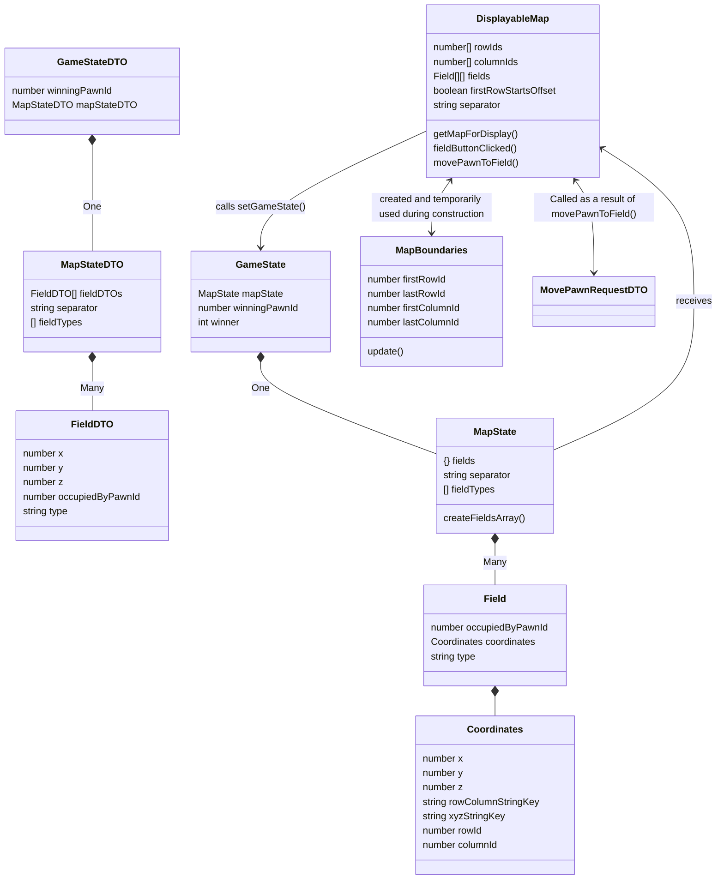
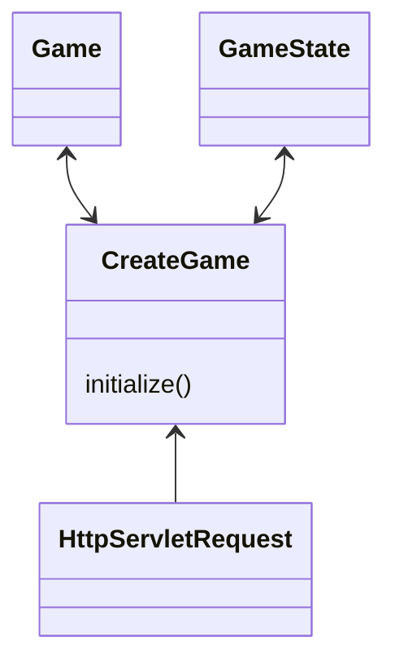
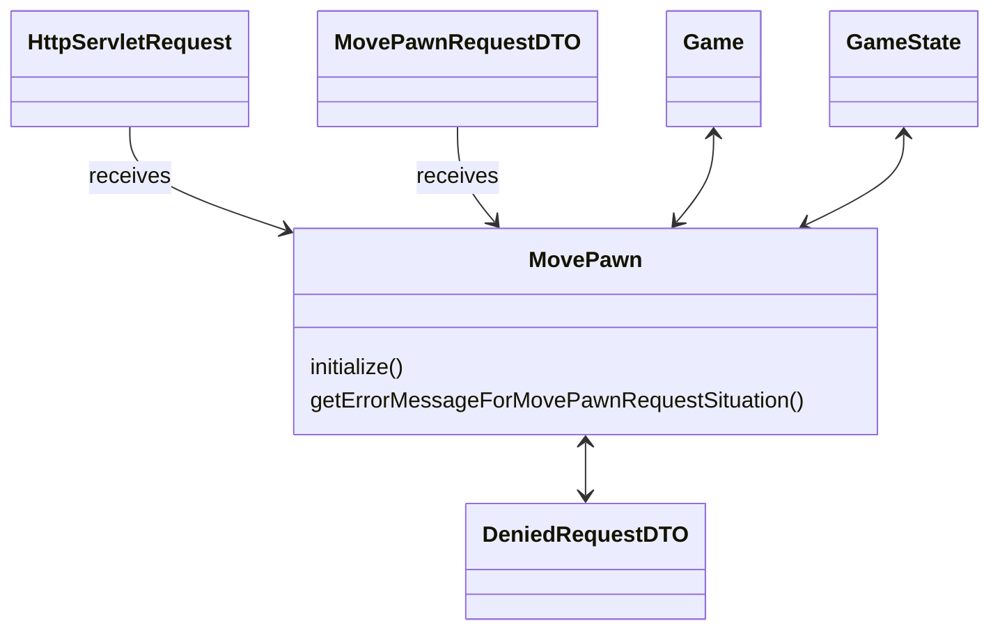
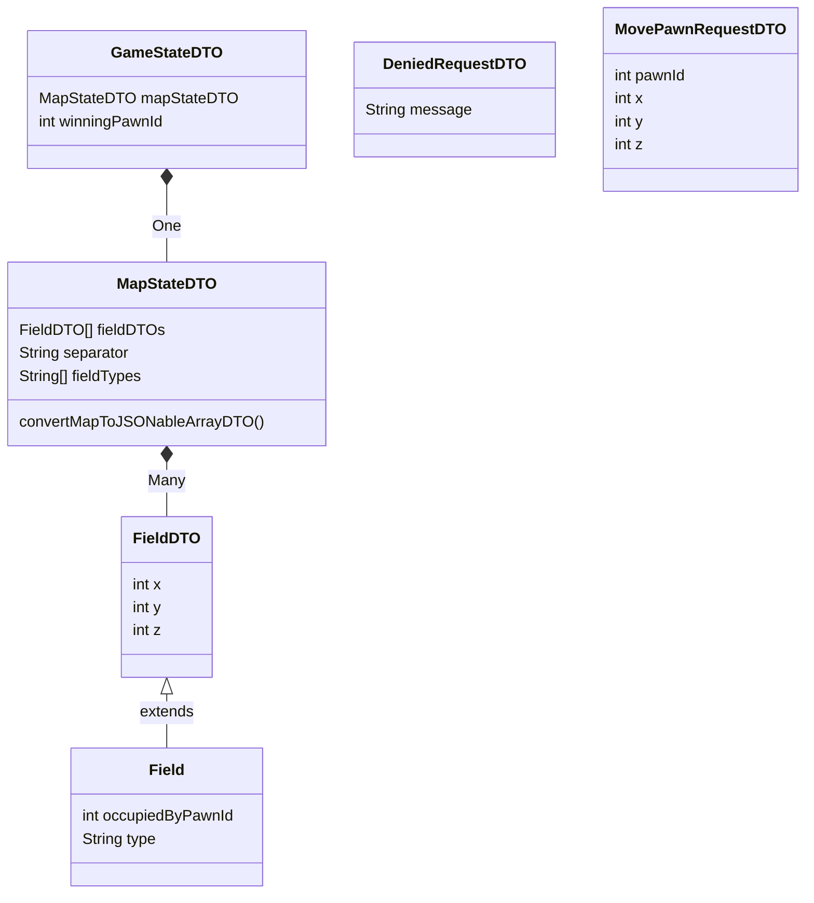
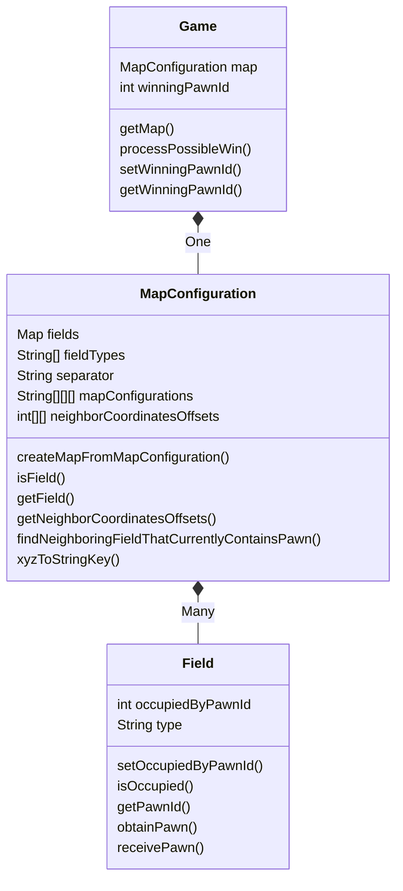

# Software architecture

## Main code flow

##### Clientside flow

##### Sequence diagram for a connecting client

##### Sequence diagram for a client that clicks on a field (button)

## Class diagram client

## Class diagram API
##### eldorado.api

##### eldorado.api.dto

## Class diagrams domain per package
##### eldorado.domain
