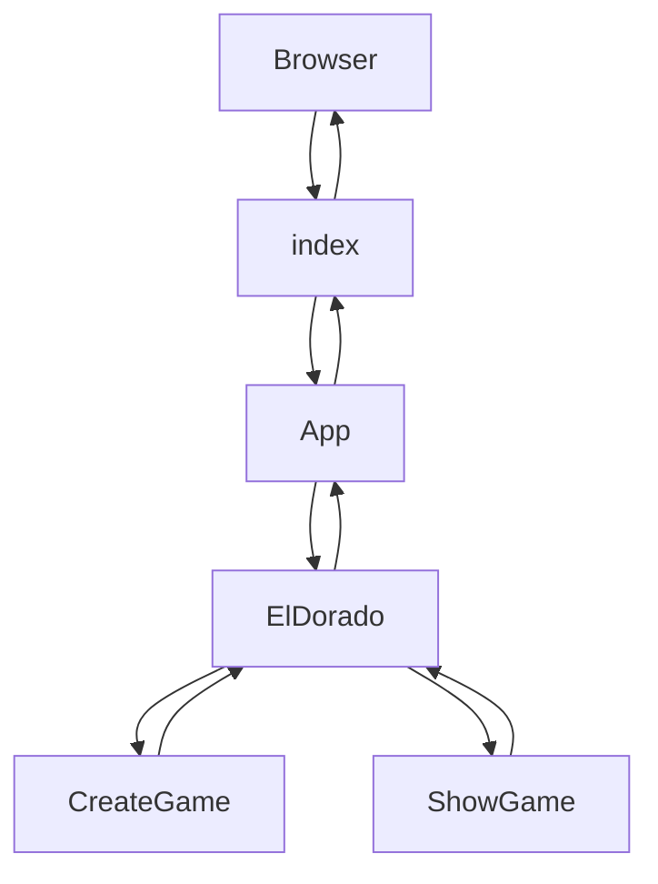
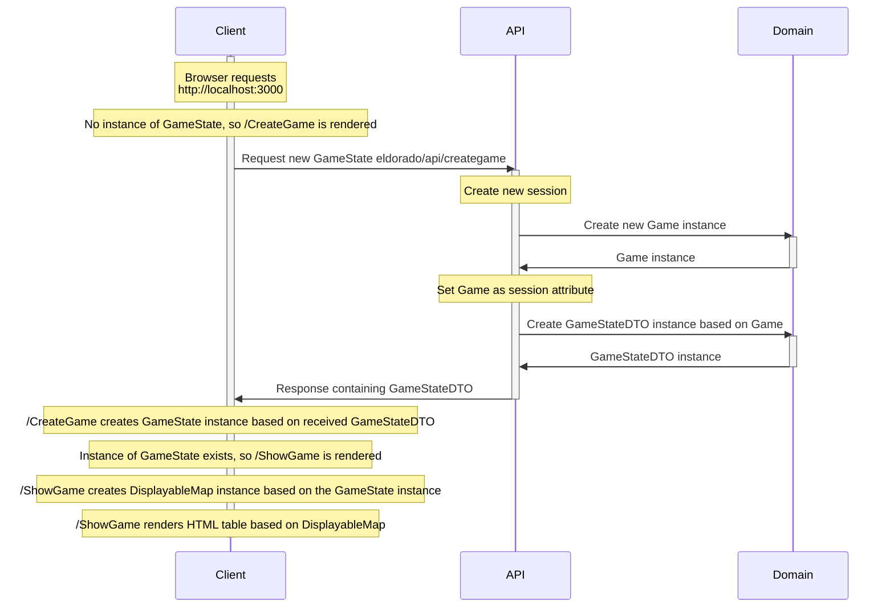
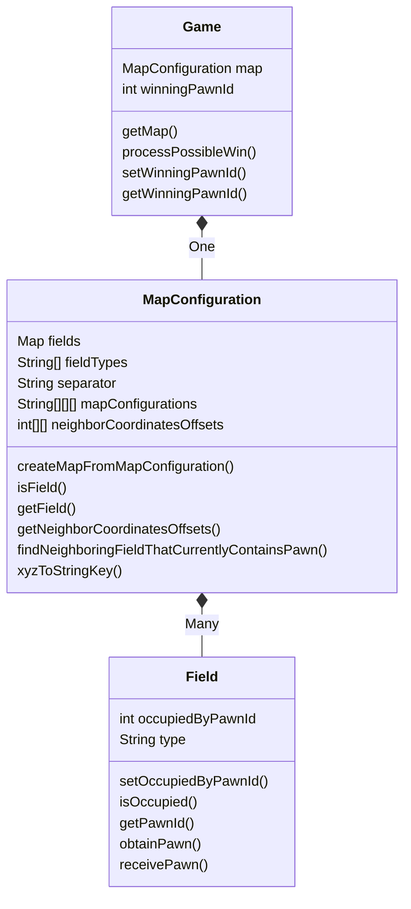
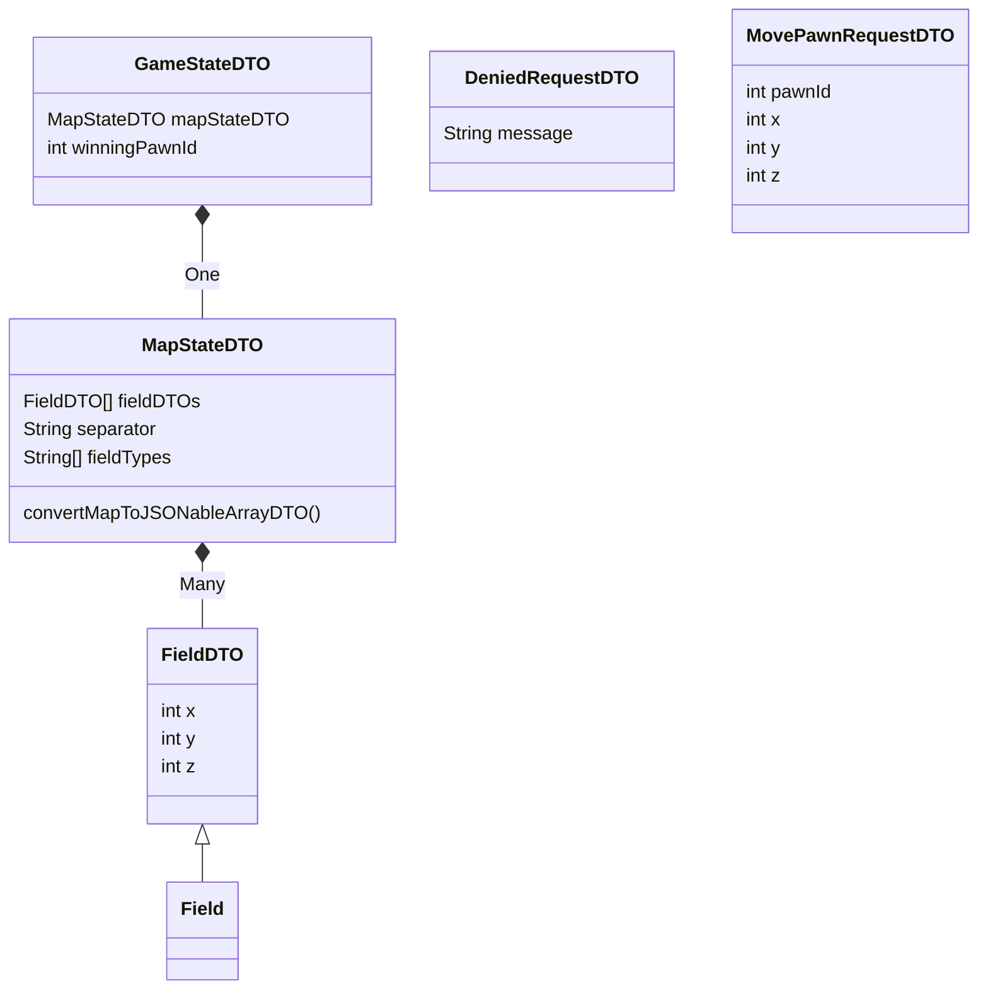

# Software architecture

## Main code flow

##### Client

```mermaid
graph TD;
	Browser-->index;
	index-->App;
	App-->ElDorado;
	ElDorado-->CreateGame;
	CreateGame-->ElDorado;	
	ElDorado-->ShowGame;
	ShowGame-->ElDorado
	ElDorado-->App;
	App-->index;
	index-->Browser;
```
##### 

```mermaid
sequenceDiagram
    participant Client
    participant API
    participant Domain
    activate Client
    Note over Client: Browser requests<br>http://localhost:3000
    Note over Client: No instance of GameState, so /CreateGame is rendered
    Client->>API: Request new GameState eldorado/api/creategame
    activate API
    Note over API: Create new session
    API->>Domain: Create new Game instance
    activate Domain
    Domain->>API: Game instance
    deactivate Domain
    Note over API: Set Game as session attribute
    API->>Domain: Create GameStateDTO instance based on Game
    activate Domain
    Domain->>API: GameStateDTO instance
    deactivate Domain
    API->>Client: Response containing GameStateDTO
    deactivate API
    Note over Client: /CreateGame creates GameState instance based on received GameStateDTO
    Note over Client: Instance of GameState exists, so /ShowGame is rendered
    Note over Client: /ShowGame creates DisplayableMap instance based on the GameState instance
    Note over Client: /ShowGame renders HTML table based on DisplayableMap
    deactivate Client
```

## Class diagrams per package

##### eldorado.domain

```mermaid
classDiagram
	Game *-- MapConfiguration : One
	Game : MapConfiguration map
	Game : int winningPawnId
	Game : getMap()
	Game : processPossibleWin()
	Game : setWinningPawnId()
	Game : getWinningPawnId()
	MapConfiguration *-- Field : Many
	MapConfiguration : Map<String,Field> fields
	MapConfiguration : String[] fieldTypes
	MapConfiguration : String separator
	MapConfiguration : String[][][] mapConfigurations
	MapConfiguration : int[][] neighborCoordinatesOffsets
	MapConfiguration : createMapFromMapConfiguration()
	MapConfiguration : isField()
	MapConfiguration : getField()
	MapConfiguration : getNeighborCoordinatesOffsets()
	MapConfiguration : findNeighboringFieldThatCurrentlyContainsPawn()
	MapConfiguration : xyzToStringKey()
	Field : int occupiedByPawnId
	Field : String type
	Field : setOccupiedByPawnId()
	Field : isOccupied()
	Field : getPawnId()
	Field : obtainPawn()
	Field : receivePawn()
```
##### eldorado.domain.dto

```mermaid
classDiagram
	GameStateDTO *-- MapStateDTO : One
	GameStateDTO : MapStateDTO mapStateDTO
	GameStateDTO : int winningPawnId
	MapStateDTO *-- FieldDTO : Many
	MapStateDTO : FieldDTO[] fieldDTOs
	MapStateDTO : String separator
	MapStateDTO : String[] fieldTypes
	MapStateDTO : convertMapToJSONableArrayDTO()
	FieldDTO : int x
	FieldDTO : int y
	FieldDTO : int z
	FieldDTO <|-- Field
	class DeniedRequestDTO
	DeniedRequestDTO : String message
	class MovePawnRequestDTO
	MovePawnRequestDTO : int pawnId
	MovePawnRequestDTO : int x
	MovePawnRequestDTO : int y
	MovePawnRequestDTO : int z
```