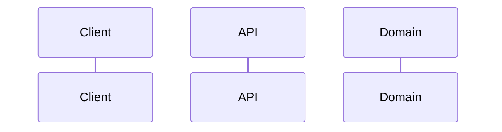
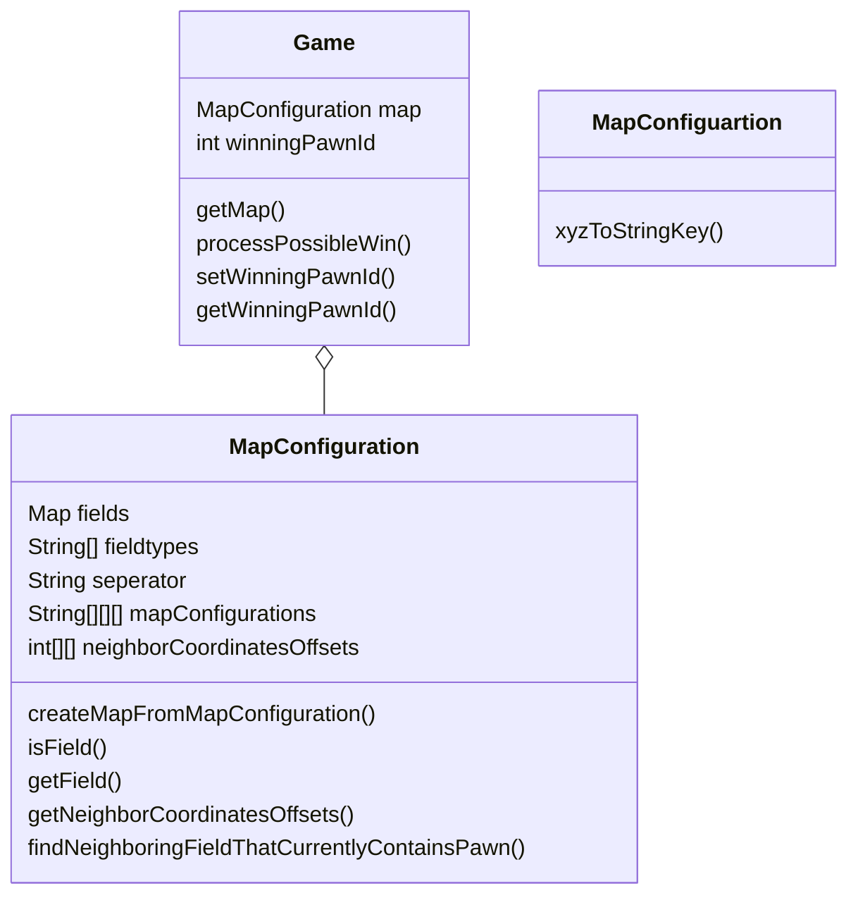

# Software architecture

## Main code flow

```mermaid
sequenceDiagram
    participant Client
    participant API
    participant Domain
```

## Class diagrams

```mermaid
classDiagram
	Game o-- MapConfiguration
	Game : MapConfiguration map
	Game : int winningPawnId
	Game : getMap()
	Game : processPossibleWin()
	Game : setWinningPawnId()
	Game : getWinningPawnId()
	MapConfiguration : Map<String,Field> fields
	MapConfiguration : String[] fieldtypes
	MapConfiguration : String seperator
	MapConfiguration : String[][][] mapConfigurations
	MapConfiguration : int[][] neighborCoordinatesOffsets
	MapConfiguration : createMapFromMapConfiguration()
	MapConfiguration : isField()
	MapConfiguration : getField()
	MapConfiguration : getNeighborCoordinatesOffsets()
	MapConfiguration : findNeighboringFieldThatCurrentlyContainsPawn()
	MapConfiguartion : xyzToStringKey()
```