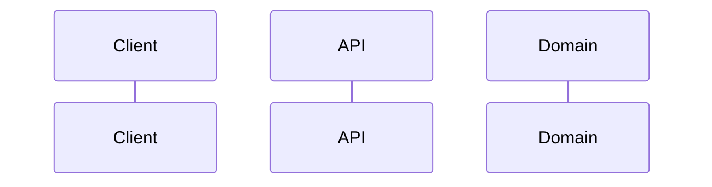
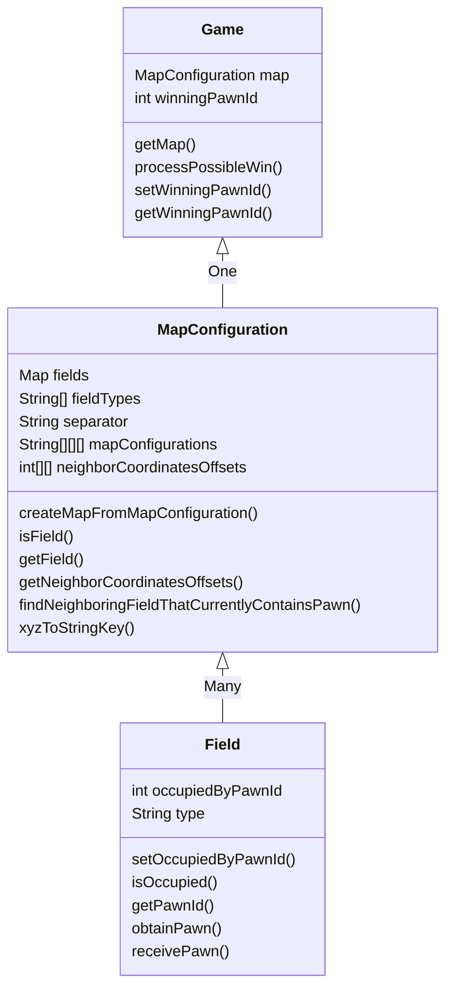

# Software architecture

## Main code flow


## Class diagrams per package


##### eldorado.domain

##### eldorado.domain.dto
```mermaid
classDiagram
	GameStateDTO : MapStateDTO mapStateDTO
	GameStateDTO : int winningPawnId
	GameStateDTO <|-- MapStateDTO : One
	MapStateDTO : FieldDTO[] fieldDTOs
	MapStateDTO : String separator
	MapStateDTO : String[] fieldTypes
	MapStateDTO : convertMapToJSONableArrayDTO()
	MapStateDTO <|-- FieldDTO : Many
	FieldDTO : int x
	FieldDTO : int y
	FieldDTO : int z
	FieldDTO o- Field
```