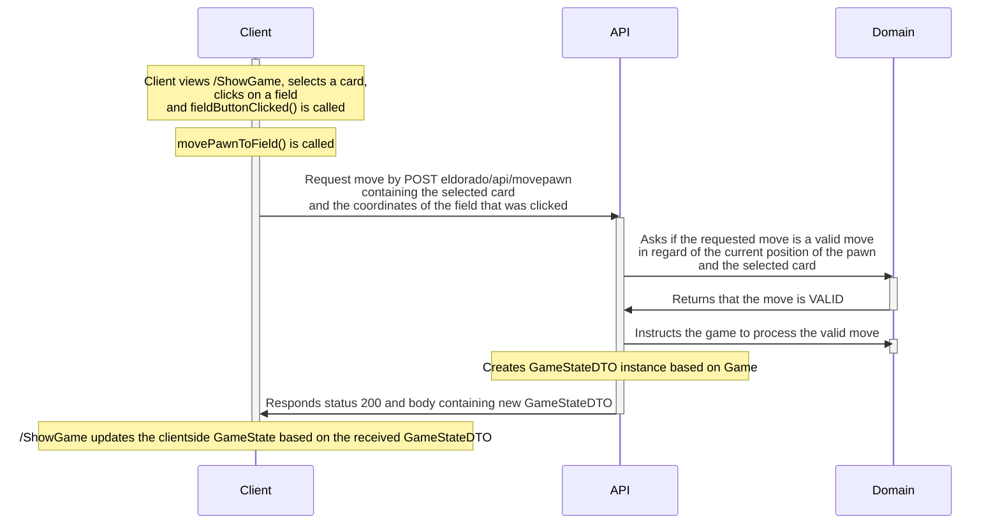
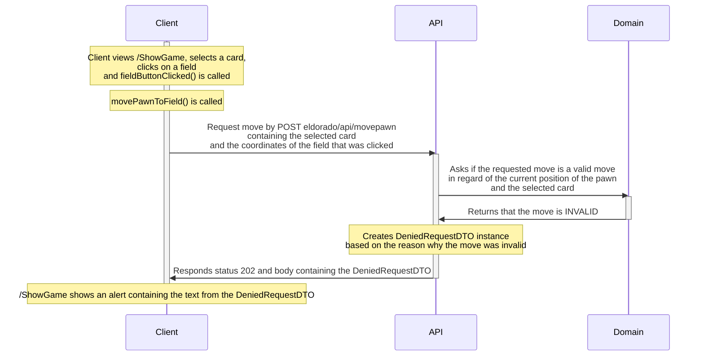
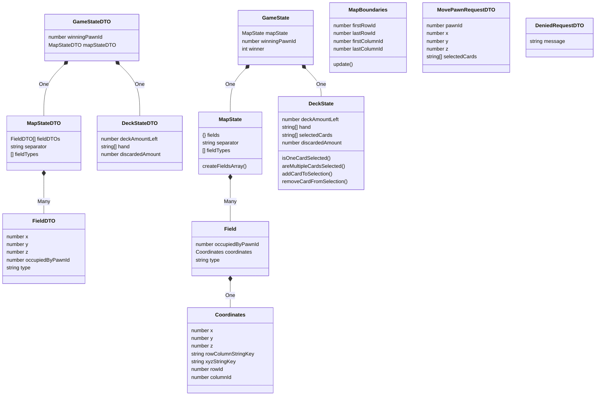
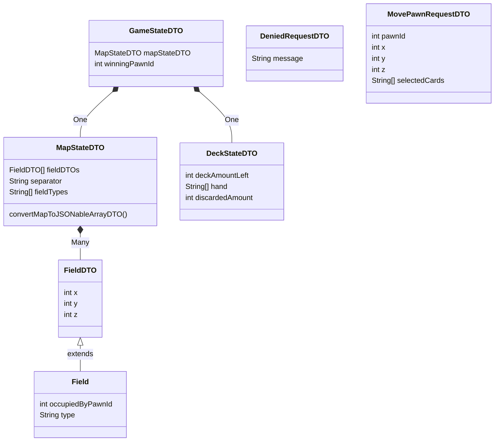
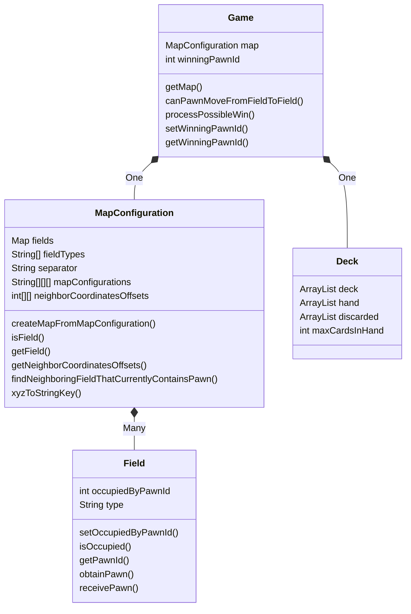

# Software architecture

Updated 01-06-2021

## Repository organization
##### Client (JS)
/client/src
Game state and DTO: /client/src/ElDorado/GameState
Game phases (CreateGame, ShowGame etc.): /client/src/ElDorado/GamePhases
Images used to display the game: /client/public

##### API (Java)
/lib/src/main/java/eldorado/api
API DTOs: /lib/src/main/java/eldorado/api/dto

Tests:
/lib/src/test/java/eldorado/api

##### Domain (Java)
/lib/src/main/java/eldorado/domain
Map configurations are hardcoded in: /lib/src/main/java/eldorado/domain/MapConfiguration

Tests:
/lib/src/test/java/eldorado/domain

## Main code flow
##### Client connects and gets to see the game map - sequence diagram

##### Client moves the pawn by performing a VALID move - sequence diagram

##### Client moves the pawn by performing an INVALID move - sequence diagram

##### Client pages flow

## Client class diagram

## API class diagram
##### eldorado.api

##### eldorado.api.dto

## Domain class diagrams
##### eldorado.domain
